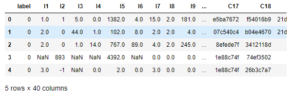
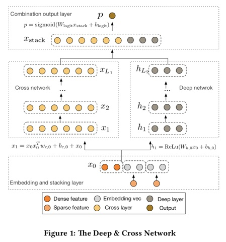
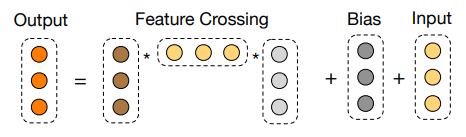

# tensorflow2.0 实现的 DCN (Deep &amp; Cross Network) ，使用 Criteo 子数据集加以实践。
本文的CSDN地址：https://blog.csdn.net/VariableX/article/details/107733410

本篇文章讲解 DeepFM 的 tensorflow2.0 实现，并使用 Criteo 数据集的子集加以实践。如果在看本文时有所困惑，可以看看DeepFM的相关理论：[CTR 模型之 Deep & Cross (DCN) 与 xDeepFM 解读](https://blog.csdn.net/VariableX/article/details/107708856)。

本文使用的数据下载地址于代码获取地址在文末获取。

首先了解一下 Criteo数据集，它由有39个特征，1个label列，其中以I开头的为数值型特征，以C开头的为类别特征：



可以看到数据中有缺失值需要填充，并且类别变量需要进行类别编码(onehot 编码的任务交给模型)，这部分预处理的代码不详细讲了。

为了方便后面建立模型，先将特征划分为 dense 特征与 sparse 特征两个类别：

```python
# 数值型
dense_feats = [f for f in cols if f[0] == "I"]
# 类别型
sparse_feats = [f for f in cols if f[0] == "C"]
```

## Deep & Cross Network

DCN网络结构如下：



### 构造模型输入

对于 dense 特征，按下面的代码构造输入：

```python
# 构造每个 dense 特征的输入
dense_inputs = []
for f in dense_feats:
    _input = Input([1], name=f)
    dense_inputs.append(_input)
# 将输入拼接到一起
concat_dense_inputs = Concatenate(axis=1)(dense_inputs)  # ?, 13
```

对于 sparse 特征，按下面的代码构造输入：

```python
# 这里单独对每一个 sparse 特征构造输入，
# 目的是方便后面构造二阶组合特征
sparse_inputs = []
for f in sparse_feats:
    _input = Input([1], name=f)
    sparse_inputs.append(_input)

# embedding size
k = 8
# 对sparse特征进行embedding
sparse_kd_embed = []
for _input in sparse_inputs:
    f = _input.name.split(':')[0]
    voc_size = total_data[f].nunique()
    _embed = Flatten()(Embedding(voc_size, k, embeddings_regularizer=tf.keras.regularizers.l2(0.7))(_input))
    sparse_kd_embed.append(_embed)

# 将sparse特征拼接在一起
concat_sparse_inputs = Concatenate(axis=1)(sparse_kd_embed)
```

然后将所有的 dense 输入和 sparse 输入拼接到一起：

```python
embed_inputs = Concatenate(axis=1)([concat_sparse_inputs, concat_dense_inputs])
```

### Cross Network

终于来到最核心的 Cross 部分，其中第 $l + 1$ 层的计算过程为：


$$
x_{l+1} =x_0x^T_lw_l + b_l + x_l
$$
此公式的实现代码如下：

```python
def cross_layer(x0, xl):
    """
    实现一层cross layer
    @param x0: 特征embeddings
    @param xl: 前一层的输出结果
    """
    # 1.获取xl层的embedding size
    embed_dim = xl.shape[-1]
    # 2.初始化当前层的W和b
    w = tf.Variable(tf.random.truncated_normal(shape=(embed_dim,), stddev=0.01))
    b = tf.Variable(tf.zeros(shape=(embed_dim,)))
    # 3.计算feature crossing
    # 下面的reshape操作相当于将列向量转换为行向量
    x1_T = tf.reshape(xl, [-1, 1, embed_dim])
    # 行向量与列向量的乘积结果是一个标量
    x_lw = tf.tensordot(x1_T, w, axes=1)
    cross = x0 * x_lw 
    return cross + b + xl
```

这个代码的执行结果是第 $l+1$ 层的输出，共分为三个步骤：

1. 获取前一层的输出结果的嵌入维度
2. 初始化本层的网络参数
3. 进行特征交叉

关键在于第三步，计算 $x_0x^T_lw_l$ 时，如果先计算 $x_0x^T$则会得到一个矩阵，为了优化内存的使用，可以先计算 $x^T_lw_l$ 得到标量，然后再与 $x_0$ 相乘得到 feature crossing。

接下来可以利用循环构建多层 crossing layer：

```python
def build_cross_layer(x0, num_layer=3):
    """
    构建多层cross layer
    @param x0: 所有特征的embeddings
    @param num_layers: cross net的层数
    """
    # 初始化xl为x0
    xl = x0
    # 构建多层cross net
    for i in range(num_layer):
        xl = cross_layer(x0, xl)
    
    return xl
    
# cross net
cross_layer_output = build_cross_layer(embed_inputs, 3)
```

### DNN 部分

这部分好理解，直接上代码吧：

```python
fc_layer = Dropout(0.5)(Dense(128, activation='relu')(embed_inputs))
fc_layer = Dropout(0.3)(Dense(128, activation='relu')(fc_layer))
fc_layer_output = Dropout(0.1)(Dense(128, activation='relu')(fc_layer))
```

### 输出部分

代码如下：

```python
stack_layer = Concatenate()([cross_layer_output, fc_layer_output])
output_layer = Dense(1, activation='sigmoid', use_bias=True)(stack_layer)
```

### 完善模型

```python
model = Model(dense_inputs+sparse_inputs, output_layer)
model.compile(optimizer="adam", 
              loss="binary_crossentropy", 
              metrics=["binary_crossentropy", tf.keras.metrics.AUC(name='auc')])
```

### 训练模型

```python
train_data = total_data.loc[:500000-1]
valid_data = total_data.loc[500000:]

train_dense_x = [train_data[f].values for f in dense_feats]
train_sparse_x = [train_data[f].values for f in sparse_feats]
train_label = [train_data['label'].values]

val_dense_x = [valid_data[f].values for f in dense_feats]
val_sparse_x = [valid_data[f].values for f in sparse_feats]
val_label = [valid_data['label'].values]

model.fit(train_dense_x+train_sparse_x, 
          train_label, epochs=5, batch_size=128,
          validation_data=(val_dense_x+val_sparse_x, val_label),
         )
```

最后，本文的代码链接在：https://github.com/zxxwin/tf2_DCN 。

数据下载地址为：链接：https://pan.baidu.com/s/1Qy3yemu1LYVtj0Wn47myHQ 提取码：pv7u


参考文章：

[CTR预估模型：DeepFM/Deep&Cross/xDeepFM/AutoInt代码实战与讲解](https://zhuanlan.zhihu.com/p/109933924)

[NELSONZHAO/zhihu/ctr_models/DCN](https://github.com/NELSONZHAO/zhihu/blob/master/ctr_models/DCN.ipynb)
